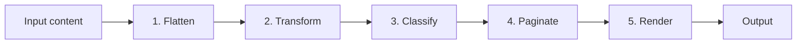

# Basho 0.1.1 — Hardened Japanese/Korean/Chinese Vertical Typesetting


Basho (芭蕉) is a vertical CJK typesetting package for Typst. This local 0.1.1 fork adds Japanese, Korean, Simplified Chinese, and Traditional Chinese profiles, atomic vertical-line pagination, deterministic source continuation, configurable Latin/TCY orientation, contextual punctuation normalization, and an opt-in Unicode vertical-glyph fallback.

It is *JLREQ/KLREQ-aware*, not a claim of complete conformance. Core direction, line order, paragraph indentation, basic kinsoku, hanging punctuation, TCY, Hangul orientation, and mixed-script direction are implemented. Full character-class tables, warichu, emphasis marks, and standards-complete ruby behavior remain future work.

## Usage

### Minimal example

```typst
#import "@preview/basho:0.1.1": tate

#set text(font: "Harano Aji Mincho")
#set page(paper: "jp-business-card")

#show: tate

閑さや

　岩にしみ入る

　　蝉の声
```


### Full example

An extended example with various features is available [here](https://github.com/KoyaTofu42/typst-basho/blob/0f49f8bbd95b5b2cc62d4393a3bccc25127f7ea3/example/Japanese-vertical.pdf). An example of Japanese novel typeset is available [here](https://github.com/KoyaTofu42/typst-basho/blob/0f49f8bbd95b5b2cc62d4393a3bccc25127f7ea3/example/Japanese-novel.pdf).

### Inline macros

| Macro | Description |
|---|---|
| `#tcy[body]` | Tate-chu-yoko — short horizontal text or content in a vertical column |
| `#vert[body]` | Force upright (one char or content per box, no rotation) |
| `#ruby(body, rt)` | Furigana annotation (accepts any content) |
| `#turn[body]` | Rotate content 90° clockwise |
| `#vblock[body]` | Rotated block (unrestricted width) |
| `#hblock[body]` | Horizontal block (no rotation) |

### Inline rendering

`#tate-inline(body, config)` renders content as a vertical stack without pagination — useful inside `#hblock[...]` or other upright contexts.

## Customization

Basho accepts a `config` dictionary on `#tate()` to tweak layout and rendering:

```typst
#tate(config: (
  language: "ja", // "ja", "ko", or "zh"
  region: "JP",   // CN/SG -> Simplified, TW/HK/MO -> Traditional
  page-start: false,
  unicode-vertical-fallbacks: false,
  korean-fullwidth-cjk-spaces: false,
  latin-orientation: "rotate", // or "upright"
  tcy-max-digits: 2,
  layout: (
    width: 100%,
    height: 72%,
    rows: 2,
    columns-per-row: 2,
    gap: 0.6em,
    column-gap: 2em,
    row-gap: 2em,
    row-fit-threshold: 1.5,
    paragraph-indent: 1.5em,
  ),
  sizing: (char-box: 1.2em),
))[...]
```

`page-start: false` allows vertical text in figures and in the current flow; opt into a fresh page when a book design requires it. `layout.width` and `layout.height` define the total vertical-writing rectangle relative to the space available where the block begins; continuations recalculate percentages against the fresh page. `layout.columns-per-row` and `layout.rows` partition that rectangle into text regions, not individual vertical lines: text runs down a line, continues to the left inside its region, then advances to the next region from right to left, then to the next region row downward, and finally to the next page. Each region may therefore contain as many ordinary vertical lines as its width permits. On a partial page, `row-fit-threshold: 1.5` uses one adaptive row below 1.5 nominal rows of space and admits a second row once that threshold is reached. Multiple independent streams receive equal horizontal lanes so short blocks share the full measure instead of clustering at the right. `gap` is the line gap inside a region; `column-gap` and `row-gap` are region gutters. The old `layout.columns` field remains a compatibility alias for region columns. `korean-fullwidth-cjk-spaces: true` promotes only Korean spaces with CJK context on both sides to a 1-em advance; spaces touching Latin, Greek, Cyrillic, or digits remain narrow. Use `tate-inline` for a compact unwrapped vertical stack and `tate-region` when a parent compositor needs a fixed-height, intrinsic-width stream. Keep `unicode-vertical-fallbacks: false` when the font implements OpenType `vert`/`vrt2`; set it to `true` only for deficient fonts that need Unicode vertical presentation forms substituted explicitly. Any nested option can still be supplied through `config`; dictionaries merge recursively and module arrays replace their defaults as complete extension units.

See [docs/configuration.md](https://github.com/KoyaTofu42/typst-basho/blob/0f49f8bbd95b5b2cc62d4393a3bccc25127f7ea3/docs/configuration.md) for the full options reference and [docs/extending.md](https://github.com/KoyaTofu42/typst-basho/blob/0f49f8bbd95b5b2cc62d4393a3bccc25127f7ea3/docs/extending.md) for custom modules.

### Feature peek


<details>

<summary>Show code</summary>

```typst
#import "@preview/basho:0.1.1": hblock, ruby, tate, vblock
#set text(font: "Harano Aji Mincho")
#set page(width: 450pt,height: 350pt)


#tate(config: (layout: (columns: 2)))[
  = ポラーノの広場

  そのころわたくしは、モリーオ市の博物局に勤めて居りました。
  　十八等官でしたから役所のなかでも、ずうっと下の方でしたし#ruby("俸給", "ほうきゅう")もほんのわずかでしたが、受持ちが標本の採集や整理で生れ付き好きなことでしたから、わたくしは毎日ずいぶん愉快にはたらきました。殊にそのころ、モリーオ市では競馬場を植物園に#ruby("拵", "こしら")え直すというのでその景色のいいまわりにアカシヤを植え込んだ広い地面が、切符売場や信号所の建物のついたまま、わたくしどもの役所の方へまわって来たものですから、わたくしはすぐ宿直という名前で月賦で買った小さな蓄音器と二十枚ばかりのレコードをもって、その番小屋にひとり住むことになりました。わたくしはそこの馬を置く場所に板で小さなしきいをつけて一疋の山羊を飼いました。毎
]
```

</details>


<details>

<summary>Show code</summary>

```typst
#import "@preview/basho:0.1.1": hblock, ruby, tate, vblock
#set text(font: "Harano Aji Mincho")
#set page(width: 450pt,height: 350pt)

#tate[
  == Fourier変換
  次によって定義されるFourier変換
  $
    integral_(-oo)^(oo) f(x) e^(-2 pi i k x) d x, quad "where" x, k in R
  $
  は位置空間$x$から波数空間$k$への変換である。

  == 形容詞の活用表
  #hblock(table(
    columns: 2,
    tate[ク活用], [],
    tate[から], tate[未然形],
    tate[かり], tate[連用形],
    tate[◯], tate[終止形],
    tate[かる], tate[連体形],
    tate[かれ], tate[命令形],
  ))

  == 短冊
  #rect(
    fill: rgb(255, 240, 240),
    tate(
      [奥山に 紅葉踏みわけ 鳴く鹿の

        声きく時ぞ 秋は悲しき],
    ),
  )
]
```

</details>

---

## Architecture

Basho renders vertical text through a 5-stage pipeline built on a **Dependency Injection** architecture — every component (rendering transforms, TCY classification, kinsoku rules, list modules) is pluggable via a single `config` dictionary.



## Learn more

| Document | Topics |
|---|---|
| [docs/architecture.md](https://github.com/KoyaTofu42/typst-basho/blob/0f49f8bbd95b5b2cc62d4393a3bccc25127f7ea3/docs/architecture.md) | Full pipeline details, token types, node-renderer dispatch table, source map |
| [docs/configuration.md](https://github.com/KoyaTofu42/typst-basho/blob/0f49f8bbd95b5b2cc62d4393a3bccc25127f7ea3/docs/configuration.md) | `config` deep-merge, full default-opts, factory function reference, override examples |
| [docs/kinsoku.md](https://github.com/KoyaTofu42/typst-basho/blob/0f49f8bbd95b5b2cc62d4393a3bccc25127f7ea3/docs/kinsoku.md) | JIS X 4051 priority tiers, `default-resolver()` parameters, custom resolve functions |
| [docs/layout-hooks.md](https://github.com/KoyaTofu42/typst-basho/blob/0f49f8bbd95b5b2cc62d4393a3bccc25127f7ea3/docs/layout-hooks.md) | Custom page layouts via hooks, bullet/numbered list module replacement |
| [docs/token-schema.md](https://github.com/KoyaTofu42/typst-basho/blob/0f49f8bbd95b5b2cc62d4393a3bccc25127f7ea3/docs/token-schema.md) | All token types, fields, and helper functions |
| [docs/modules.md](https://github.com/KoyaTofu42/typst-basho/blob/0f49f8bbd95b5b2cc62d4393a3bccc25127f7ea3/docs/modules.md) | Module contracts for TCY, rendering, kinsoku, and list modules |
| [docs/extending.md](https://github.com/KoyaTofu42/typst-basho/blob/0f49f8bbd95b5b2cc62d4393a3bccc25127f7ea3/docs/extending.md) | Step-by-step guide to writing custom modules |

## License

MIT
